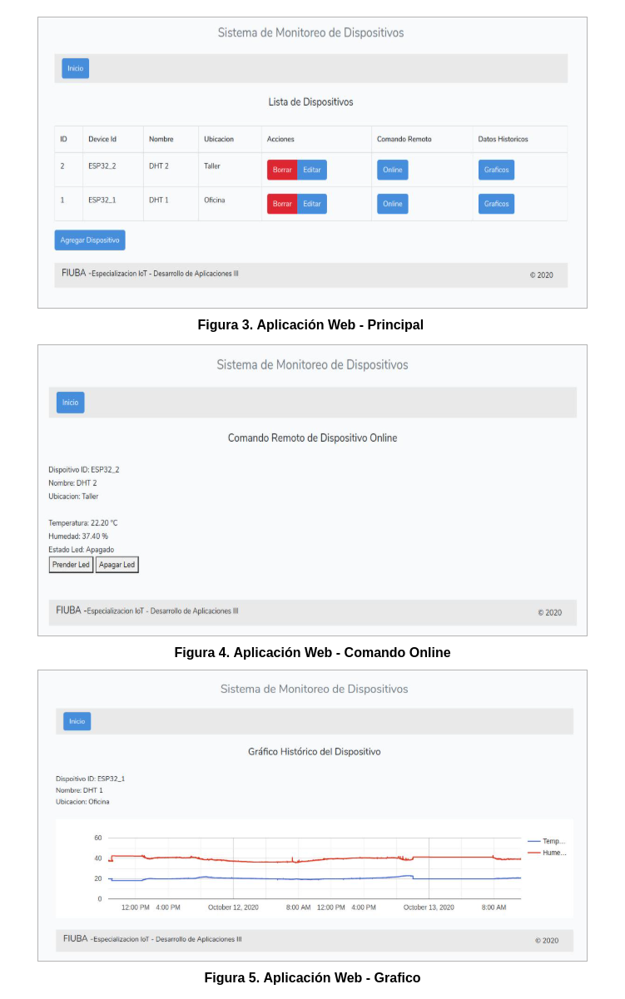

Autor: Diego Villarraza - Octubre 2020
## Introduccion 🚀

Esta aplicación fue creada para el trabajo final de la asignatura Desarrollo de Aplicaciones 3 para Iot de la carrera de Especialización de Internet de las Cosas de FIUBA.
Se trata de una aplicación que integra distintos componentes para el almacenamiento, procesamiento y visualización de datos enviados por dispositivos remotos (IoT). Tambien incluye un comando remoto basico para visualizar los datos online y ejecutar comandos a distancia.

## 
## Tabla de contenido
* [Descripción del sistema](#descripción-del-sistema)
* [Descripción del hardware](#descripción-del-hardware)
* [Instalar dependencias](#instalar-dependencias)
* [Correr la aplicación](#correr-la-aplicación)
* [Contribuir](#contribuir)
* [Licencia](#licencia)

## 
## Descripción del sistema📋
El sistema consta de tres partes las cuales se decriben a continuación:

 * Servidor MQTT

    Servidor Mosquitto corriendo de manera local en una raspberryPi4 que intercatua con dos Esp32.

 * Aplicacion On-line
 
    Esta aplicacion esta desarrollada en Node-Red en la cual se subscriben a los mensajes MQTT de los esp32 y se almacenan los datos en una base de datps sqlite. En el dashboard de node-red se muestran los valores de temperatura, humedad del dht y el estado del led incoprado en el esp32

 * Aplicacion Web

    Esta aplicacion es una SPA (aplicacion de una sola pagina) donde se utiliza Vue.js para el desarrollo del front-end y el back-end es una Api desarrollada con Laravel

## 
## Descripción del hardware🛠️
El hardware utilizando, el cual se muestra en la figura 1 consta de: 

 - Raspberry PI 4, donde corre el broker mqtt y las aplicaciones.

 - Dos ESP32 los cuales tienen conectado un sensor de temperatura y humedad DHT.


 

## 
## Instalar dependencias🔧
Para desplegar la aplicacion se necesita previamente tener instalado en la Raspberry:
* Servidor Mosquitto (Pasos de la instalacion en [docmentacion oficial](https://mosquitto.org/download/)).
* Node-Red (Pasos de la instalacion en [docmentacion oficial](https://nodered.org/docs/getting-started/local)).
* Laravel (Pasos de la instalacion en [docmentacion oficial](https://laravel.com/docs/8.x)).
* Sqlite (Pasos de la instalacion en [docmentacion oficial](https://www.sqlite.org/download.html)).

## 
## Correr la aplicación📦
Primero se debe clonar el repositorio ejecutando:
```sh
git clone https://github.com/dvillarraza/dda3_tp_final.git 
```
En la carpeta App_online se encuentran la carpetas:
   - /Node-Red donde se encuentra el arhivo flow.json el cual al que importar en un flow de Node-Red
   - /DHT_Arduino donde se encuentra el proyecto realizado con Platform.IO el cual debe cargarse en los modulos ESP32

Para desplegar la aplicación online de node-red (ver figura 2), desde un web browser ingresando a:

http://localhost:1880/ui 

 

Luego en la raiz del proyecto se encuenta la carpeta App_web en donde se encuentra el proyecto de la SPA para desplegar la aplicacion Web. 
Primero se deben instalar todas las dependencias ejecuando:
```sh
npm install
```
Crear la base de datos ejecutando
```sh
sqlite3 laravel.db
```
Crear el archivo .env ejecutando:
```sh
cp .env.example .env
```
Posteriormente debes agregar las credenciales al archivo .env
```sh
DB_CONNECTION=sqlite
DB_HOST=127.0.0.1
DB_PORT=3306
DB_DATABASE=raiz_del_proyecto/laravel.db
DB_USERNAME=root
DB_PASSWORD=
```
Finalmente para desplegar la aplicacion:
```sh
php artisan server
```
Si no se produjo ningun error, desde un web browser se puede desplegar la aplicacion (figura 3, 4 y 5) ingesando a:

http://localhost:8000 

Para finalizar la ejecucion de aplicación, presionar Cltr-C en la terminal donde se ejecuto php artisan serve

 

## 
## Contribuir🎁
Para contribuir realizar un pull request con las sugerencias.

## 
## Licencia📄
GPL
